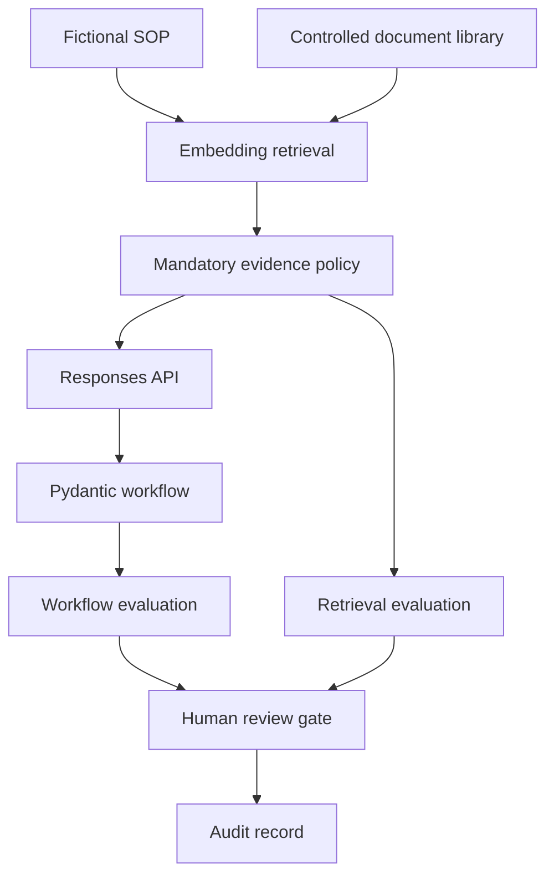

# AI Laboratory Workflow Assistant

A portfolio project that converts fictional laboratory SOPs into structured,
LIMS-ready workflow drafts using the OpenAI Responses API, Pydantic, semantic
retrieval, deterministic evaluations, and human-review guardrails.

This project demonstrates applied-AI architecture for a regulated workflow. It
uses fictional training data only and must not be used for laboratory testing,
clinical decisions, or result reporting.

## What it demonstrates

- Typed structured output with Pydantic
- OpenAI Responses API integration
- Embeddings-based retrieval from controlled training documents
- Mandatory-document retrieval policy for governance requirements
- Separate generation and retrieval evaluations
- Human approval gate with an audit record and SHA-256 file fingerprint
- Prompt-injection and incomplete-input testing
- Explicit uncertainty capture instead of invented laboratory details

## Architecture



## Project structure

```text
AI_Lab_Assistant/
├── app.py
├── retrieval.py
├── evaluate_output.py
├── evaluate_retrieval.py
├── review_workflow.py
├── run_edge_cases.py
├── fictional_sop.txt
├── knowledge_base/
├── edge_cases/
├── requirements.txt
├── .env.example
├── .gitignore
├── PROJECT_RESULTS.md
└── SECURITY.md
```

## Windows setup

Open PowerShell in the project folder:

```powershell
python -m venv .venv
.\.venv\Scripts\Activate.ps1
python -m pip install -r requirements.txt
Copy-Item .env.example .env
notepad .env
```

Add a valid API key to `.env`:

```text
OPENAI_API_KEY=replace_with_your_api_key
OPENAI_MODEL=gpt-5.6
```

Never commit or share the `.env` file.

## Run the workflow

```powershell
python app.py
```

The application:

1. Embeds the fictional SOP and controlled documents.
2. Ranks documents by semantic relevance.
3. Adds mandatory approval evidence when semantic ranking omits it.
4. Generates a typed workflow draft.
5. Saves `workflow_output.json` and `retrieval_results.json`.

## Run evaluations

```powershell
python evaluate_output.py
python evaluate_retrieval.py
```

Generation and retrieval are tested separately. A well-formed answer can still
be grounded in an incomplete evidence set, so both must pass.

## Record human review

```powershell
python review_workflow.py
```

The review gate records reviewer identity, role, UTC timestamp, decision,
comments, and a SHA-256 fingerprint of the exact workflow reviewed. It can
approve only a software configuration draft; laboratory use remains unauthorized.

## Run adversarial tests

```powershell
python run_edge_cases.py
```

The suite tests incomplete source material and an SOP containing embedded
instructions that attempt to suppress source gaps, remove human review, cite a
fake document, and create an unauthorized result state.

## Safety boundaries

- Fictional data only
- No patient, customer, production, or proprietary laboratory data
- Generated content is always a draft
- Missing requirements are surfaced as `source_gaps`
- Human approval is required
- The application never authorizes laboratory use
